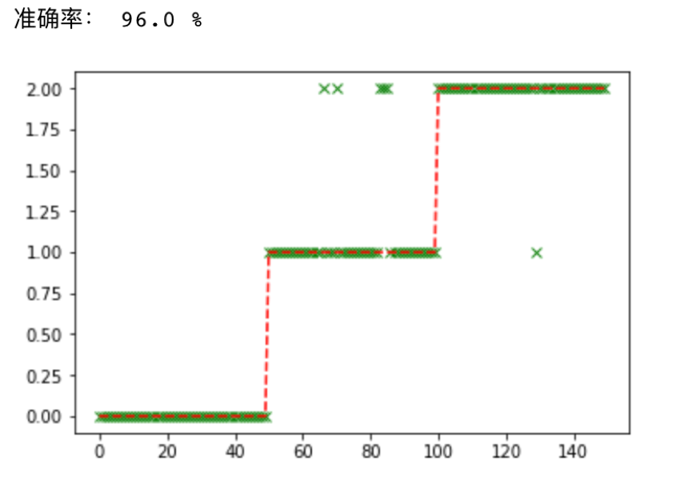
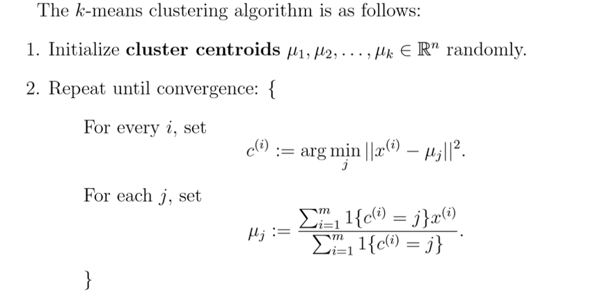
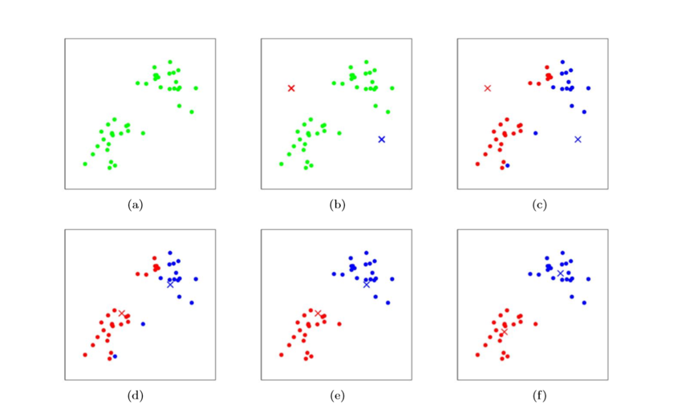
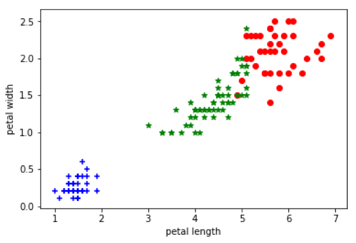

# 分类与聚类

## 实验目的

1、了解机器学习的LogisticRegression分类算法、K-means聚类算法

2、能使用LogisticRegression算法、K-means算法进行简单的数据集应用

## 实验知识

1、分类：分类是根据一些给定的已知类别标号的样本，训练某种学习机器（即得到某种目标函数），使它能够对未知类别的样本进行分类。这属于supervised learning（监督学习）

2、聚类聚类指事先并不知道任何样本的类别标号，希望通过某种算法来把一组未知类别的样本划分成若干类别，聚类的时候，我们并不关心某一类是什么，我们需要实现的目标只是把相似的东西聚到一起，这在机器学习中被称作 unsupervised learning （无监督学习）

## 实验内容

1、应用LogisticRegression分类算法，对Iris数据集进行分类

2、应用K-means聚类算法，对Iris数据集进行聚类

**实验一 LogisticRegression分类算法 **

【代码】

```python
import pandas as pd

import seaborn as sns

import numpy as np

import matplotlib.pyplot as plt

from sklearn import datasets

from sklearn import linear_model,model_selection

%matplotlib inline

import warnings

warnings.filterwarnings('ignore')

 

\# 导入数据集

iris = datasets.load_iris() 

lg = linear_model.LogisticRegression(multi_class='ovr') # 采用 one-vs-rest 的多分类策略

predicted = model_selection.cross_val_predict(lg, iris.data, iris.target, cv=5) # 5个KFold交叉验证集

\# 判断分类正误率

sums = 0

for i in range(len(predicted)):

​    if predicted[i] == iris.target[i]:

​        sums += 1

print('准确率：',sums * 100.0 / len(predicted),"%")

\# 制图

fig, ax = plt.subplots() 

ax.plot(range(len(predicted)), predicted, 'gx', label='Predicted Class')

ax.plot(range(len(iris.target)), iris.target, 'r--', label='True Class')

plt.show()
```


【结果】



**实验二： K-means聚类算法**

K-means算法流程





【代码】

```python
import pandas as pd 

import numpy as np

import matplotlib.pyplot as plt

def LoadData(filename):

​    data=pd.read_csv(filename)

​    return data.values[:,0:4]


#初始化k个centroid

def randCent(dataSet, k):

​    n = np.shape(dataSet)[1]

​    centroids = np.mat(np.zeros((k,n)))   # 每个质心有n个坐标值，总共要k个质心

​    for j in range(n):

​        minJ = min(dataSet[:,j])

​        maxJ = max(dataSet[:,j])

​        rangeJ = float(maxJ - minJ)

​        centroids[:,j] = minJ + rangeJ * np.random.rand(k, 1)

​    return centroids

 

#计算欧几里得距离

def distEclud(vecA, vecB):

​    return np.sqrt(np.sum(np.power(vecA - vecB, 2))) # 求两个向量之间的距离

 

def plot_centroid(data, clusterAssignment):

​    m = np.shape(data)[0]

​    for i in range(m):

​        if clusterAssignment[i,0]==0:

​            plt.scatter(data[i, 0], data[i, 1], c = "red", marker='o')

​        elif clusterAssignment[i,0]==1:

​            plt.scatter(data[i, 0], data[i, 1], c = "green", marker='*')  

​        else :

​            plt.scatter(data[i, 0], data[i, 1], c = "blue", marker='+') 

​    plt.xlabel('petal length')  

​    plt.ylabel('petal width')    

​    plt.show() 

 

def kmeans(data, k):

​    centroids = randCent(data,k)

​    \#print (centroids)

​    m = np.shape(data)[0]

​    clusterChanged = True

​    clusterAssignment = np.zeros((m,2)) # 存放每个样本点的所属类别和距离

​    

​    \#当所有点的所属点的类别状态不再变化之后，停止更新

​    while clusterChanged:

​        clusterChanged = False

​        for i in range(m):

​            minDist = np.inf

​            minIndex = 0

​            

​            \#计算当前样本点与centroid的距离

​            for j in range(k):

​                dist = distEclud(data[i,:],centroids[j,:])

​                if dist < minDist:

​                    minDist = dist

​                    minIndex = j

​            if clusterAssignment[i,0] != minIndex:

​                clusterAssignment[i,0] = minIndex

​                clusterAssignment[i,1] = minDist

​                clusterChanged = True

​        print ("-----------------")

​        print (centroids)

​        \#print (clusterAssignment)

​        

​        \# 重新计算中心点

​        for cent in range(k):   

​            ptsInClust = data[np.nonzero(clusterAssignment[:,0] == cent)[0]]   # 去第一列等于cent的所有列

​            \#print (np.nonzero(clusterAssignment[:,0] == cent)[0])

​            centroids[cent,:] = np.mean(ptsInClust, axis = 0)  # 算出这些数据的中心点

​        

​    return centroids, clusterAssignment

 

if __name__=="__main__":

​    data = LoadData('iris.csv')

​    c, a = kmeans(data,3)

​    print (c)

​    plot_centroid(data[:,2:4],a)


```

【结果】



 