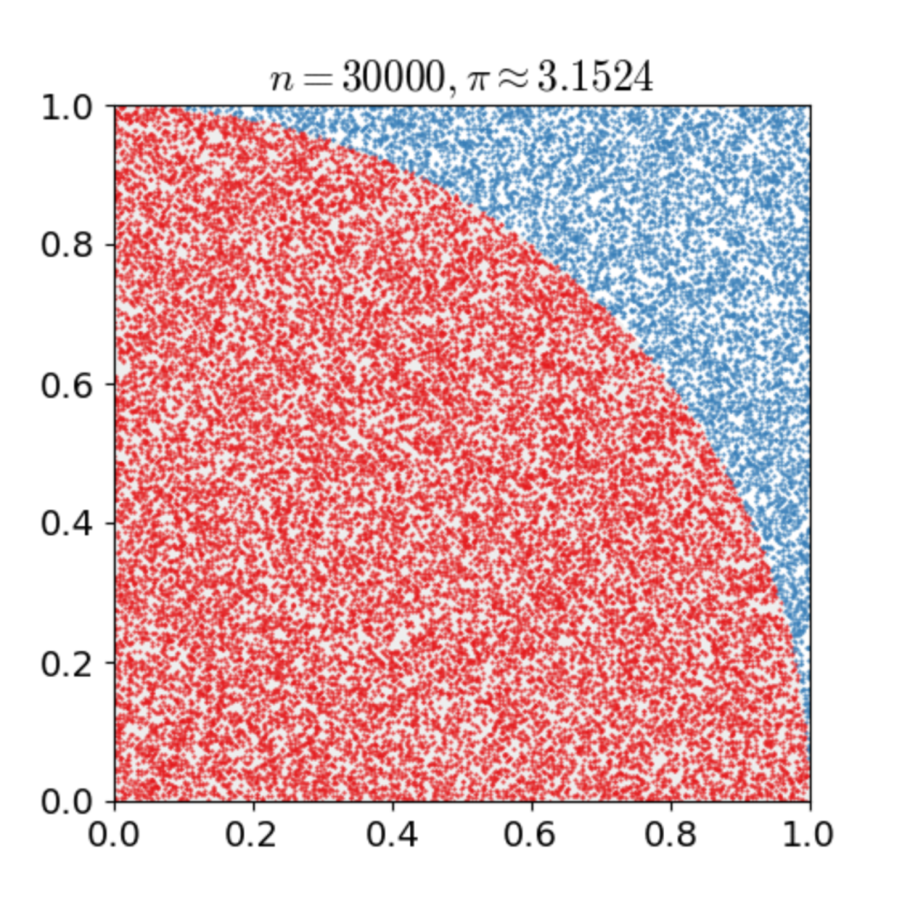

##数据思维与问题求解
##实验目的
###1.建立起用数据思维求解问题的习惯 
###2,掌握Python的基本程序结构，能够正确的书写并运行Python程序。 
##实验内容
###1. 求解根号2的三种不同方法
###2.使用蒙特卡洛法求Pi的值
##实验步骤和结果
###实验一 求解根号2的三种不同方法
####1.循环迭代，逐步逼近
####开平方1
```
def Square_root_1():
    c = 2
    i = 0
    g = 0
    for j in range(0, c+1):
        if (j * j > c and g == 0):
            g = j -1
    while(abs(g * g - c) > 0.0001):
        g += 0.00001
        i = i+1
        print ("%d:g = %.5f" % (i,g))
​
​
Square_root_1()
```

执行结果
​​
###2.二分查找法
#### 开平方2  二分法
```
def Square_root_2():
    i = 0
    c = 2
    m_max = c
    m_min = 0
    g = (m_min + m_max)/2
    while (abs(g * g - c)> 0.00000000001):
        if (g*g<c):
            m_min = g
        else :
            m_max = g
        g = (m_min + m_max)/2
        i = i + 1
        print ("%d:g = %.13f" % (i,g))
​
Square_root_2()
```


执行结果
​​
3.牛顿法
参考文献：
![]{https://zh.wikipedia.org/wiki/%E7%89%9B%E9%A1%BF%E6%B3%95
​​
###牛顿法
```
def Square_root_3():
    c = 2
    g = c/2
    i = 0
    while (abs(g*g-c)>0.00000000001):
        g = (g + c/g)/2
        i = i+1
        print ("%d:%.13f"%(i,g))
​
Square_root_3()
```

执行结果
​​

###实验二 使用蒙特卡洛法求Pi的值
参考文献：https://zh.wikipedia.org/wiki/%E8%92%99%E5%9C%B0%E5%8D%A1%E7%BE%85%E6%96%B9%E6%B3%95 

在一个边长为1的正方形内一均匀概率随机投点，该点落在此正方形的内切1/4圆中的概率即为内切圆与正方形的面积比值，所以Pi=落入圆的点数/所有点数*4。
​​
参考代码
​
#### 蒙特卡洛法求Pi
```
import random
def Pi(times):
    sum = 0
    for i in range(times):
        x = random.random()
        y = random.random()
        d2 = x*x + y*y
        if d2 <= 1 : 
            sum+=1
    return (sum/times*4)
​
​
times = 100000000
x = Pi(times)
print ("Pi = %.8f"%(x))
```
##习题
###习题[2.1]
至少用3种方法求解Pi的值，并比较它们的效率（精度保留到小数点后10位）。 

###习题[2.2]
根据蒙特卡洛法的思想，设计求解根号2的第四种方法。

