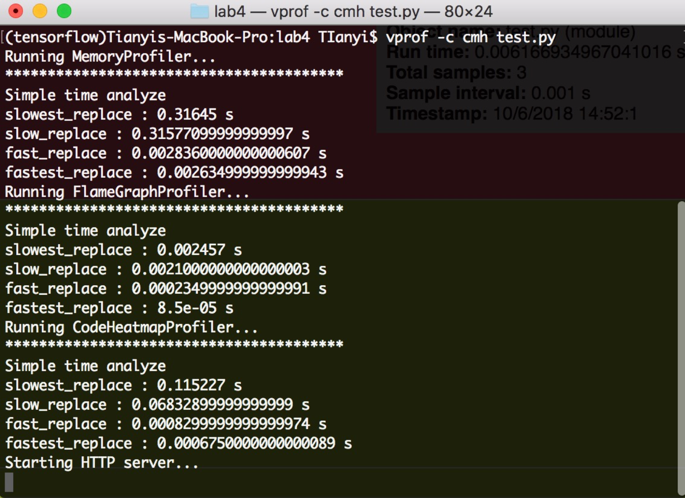
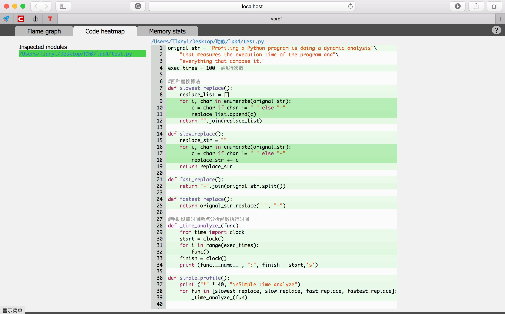

#Python程序性能评测
##实验目的
1、利用python采集与分析cpu,memory,disk的信息;
2、python performance基准测试
##实验内容
1、python获取机器的常用配置信息
2、python获取程序执行时间
##实验步骤和结果
###实验一 python获取机器的常用配置信息
[实验内容]
用python的psutil模块输出cpu,memory,disk信息
	
	import psutil as ps
	metrics = {}
​
####cpu
	cpu = ps.cpu_times()
	metrics['cpu_usage'] = ps.cpu_percent(interval = 1)
	metrics['cpu_user'] = cpu.user
	metrics['cpu_system'] = cpu.system
	metrics['cpu_idle'] = cpu.idle
​
####Memory
	mem = ps.virtual_memory()
	metrics['mem_free'] = mem.free
	metrics['mem_used'] = mem.used
	metrics['mem_available'] = mem.available
	metrics['mem_usage'] = mem.percent
​
​
####Disk

```
disk = ps.disk_io_counters(perdisk=True)
for prefix in disk.keys():
    metrics[prefix + '_' + 'read_count'] = disk[prefix].read_count
    metrics[prefix + '_' + 'write_count'] = disk[prefix].write_count
    metrics[prefix + '_' + 'read_bytes'] = disk[prefix].read_bytes
    metrics[prefix + '_' + 'read_bytes'] = disk[prefix].write_bytes
​
​
for item in metrics.items():
    print(item)
```
[实验结果]

```
('cpu_usage', 3.3)
('cpu_user', 13092.58)
('cpu_system', 3097.12)
('cpu_idle', 672095.85)
('mem_free', 3361009664)
('mem_used', 3225280512)
('mem_available', 3878764544)
('mem_usage', 52.9)
('sda1_read_count', 46)
('sda1_write_count', 0)
('sda1_read_bytes', 0)
('sda2_read_count', 42)
('sda2_write_count', 0)
('sda2_read_bytes', 0)
('sda3_read_count', 2)
('sda3_write_count', 0)
('sda3_read_bytes', 0)
('sda5_read_count', 45)
('sda5_write_count', 0)
('sda5_read_bytes', 0)
('sda6_read_count', 42)
('sda6_write_count', 0)
('sda6_read_bytes', 0)
('sda7_read_count', 161)
('sda7_write_count', 0)
('sda7_read_bytes', 0)
('sda8_read_count', 297742)
('sda8_write_count', 478514)
('sda8_read_bytes', 12095332352)
('sda9_read_count', 20881)
('sda9_write_count', 3346)
('sda9_read_bytes', 1125842944)
('sr0_read_count', 0)
('sr0_write_count', 0)
('sr0_read_bytes', 0)
```

获取的本地信息，每个人结果一般不同
###实验二 python获取程序执行时间
四种替换算法时间性能比较

```
orignal_str = "Profiling a Python program is doing a dynamic analysis"\
    "that measures the execution time of the program and"\
    "everything that compose it."
exec_times = 100000   #执行次数
```

####四种替换算法

```
def slowest_replace():
    replace_list = []
    for i, char in enumerate(orignal_str):
        c = char if char != " " else "-"
        replace_list.append(c)
    return "".join(replace_list)
​
​
def slow_replace():
    replace_str = ""
    for i, char in enumerate(orignal_str):
        c = char if char != " " else "-"
        replace_str += c
    return replace_str
​
​
def fast_replace():
    return "-".join(orignal_str.split())
​
​
def fastest_replace():
    return orignal_str.replace(" ", "-")
```

#####手动设置时间断点分析函数执行时间

```
def _time_analyze_(func):
    from time import clock
    start = clock()
    for i in range(exec_times):
        func()
    finish = clock()
    print (func.__name__ , ":", finish - start,'s')
​
​
def simple_profile():
    print ("*" * 40, "\nSimple time analyze")
    for fun in [slowest_replace, slow_replace, fast_replace, fastest_replace]:
        _time_analyze_(fun)
```
​
#####用python的timeit模块分析函数执行时间


```
def _timeit_analyze_(func):
    from timeit import Timer
    t1 = Timer("%s()" % func.__name__, "from __main__ import %s" % func.__name__)
    print (func.__name__ , ":", t1.timeit(exec_times))
​
​
def timeit_profile():
    print ("*" * 40, "\nModule timeit analyze")
    for fun in [slowest_replace, slow_replace, fast_replace, fastest_replace]:
        _timeit_analyze_(fun)
​
​
if __name__ == "__main__":
    simple_profile()
    timeit_profile()
```

[实验结果]

```
**************************************** 
Simple time analyze
slowest_replace : 1.5494550000000018 s
slow_replace : 1.2513919999999992 s
fast_replace : 0.14179299999999984 s
fastest_replace : 0.030080999999999136 s
**************************************** 
Module timeit analyze
slowest_replace : 1.558246290020179
slow_replace : 1.2700494629971217
fast_replace : 0.14182965198415332
fastest_replace : 0.030810013005975634
```
###实验三 python程序可视化分析
[实验内容]
我选择一个开源的性能分析工具vprof，原因是它可以很方便地生成火焰图。火焰图是类似下面的图形，具体了解火焰图，可以访问《如何读懂火焰图》这篇文章。
http://www.ruanyifeng.com/blog/2017/09/flame-graph.html
安装vprof很简单，使用下面这个命令：
	
	pip install vprof

收集性能数据可以使用如下命令：
	
	vprof -c cmh test.py

这样的命令，其中-c代表配置。配置里面的c，表示cpu火焰图，m表示内存图，h表示代码热图。当主程序退出后，vprof会自动收集这些数据，并且启动一个http服务器，自动打开浏览器将指定的图表打开展示出来。
保存实验二的代码为test.py，使用vprof运行代码效果如下：
​​
​​
​​
##作业
1、比较常用排序算法（冒泡排序、选择排序、插入排序，归并排序）的时间性能。
提示：
（1）python 中可以引入time模块，使用time.time()获取当前计算机时间。

（2）归并排序代码直接给出，其他三种排序自行完成。

```
def merge_sort(nums):
    lens = len(nums)
    count = lens
    n = 2
    def sort_two_list(list1,list2):
        len1 = len(list1)
        len2 = len(list2)
        list3 = []
        i,j=0,0
        while i<len1 and j<len2:
            if list1[i] < list2[j]:
                list3.append(list1[i])
                i += 1
            else:
                list3.append(list2[j])
                j += 1
        list3 += list1[i:]
        list3 += list2[j:]
        return list3
    for i in range(0,lens-1,2):
        if nums[i] > nums[i+1]:
            nums[i],nums[i+1] = nums[i+1],nums[i]
    while  n<=lens:
        list3 = []
        for j in range(0,lens,2*n):
            list3 += sort_two_list(nums[j:j+n],nums[j+n:j+2*n])
        nums = list3
        n += n
    return nums
```
（3）比较排序算法需要使用较长的无序数组，尝试使用100，1000，10000三种不同长度的无序数组进行测试，输出每次测试不同排序算法的运行时间。

​

